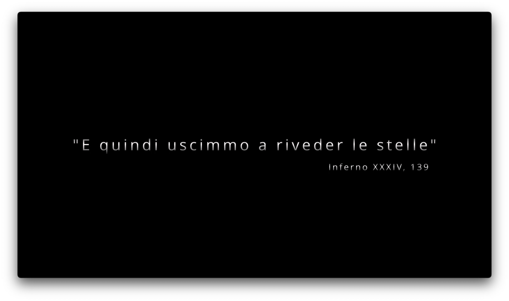
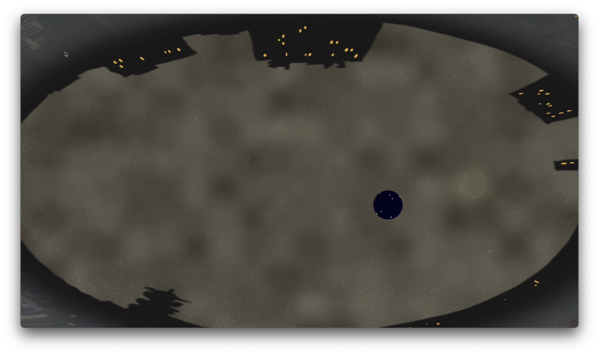
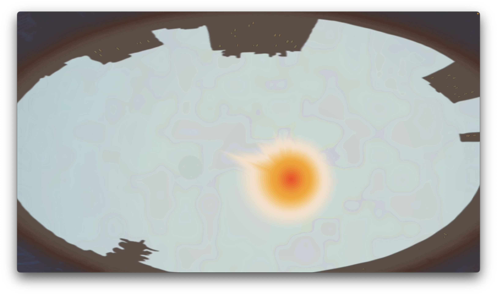
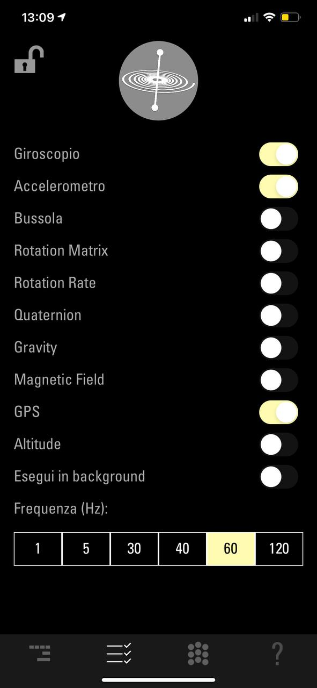
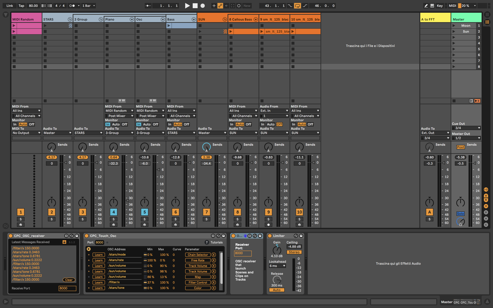

 "E quindi uscimmo a riveder le stelle" 
*(Inferno XXXIV, 139)*
===============

- [*(Inferno XXXIV, 139)*](#inferno-xxxiv-139)
  - [1. Introduction](#1-introduction)
  - [2. Discovering the Project](#2-discovering-the-project)
  - [3.  Technical Explanation](#3--technical-explanation)
  - [4. The Experience](#4-the-experience)
    - [4.1 Nighttime](#41-nighttime)
    - [4.1 Daytime](#41-daytime)
  - [5. Inside the Scene](#5-inside-the-scene)
    - [5.1 Moon](#51-moon)
    - [5.2 Sun](#52-sun)
  - [6. Stars](#6-stars)
    - [6.1 star](#61-star)
    - [6.2 starsTable](#62-starstable)
    - [6.3 starSystem](#63-starsystem)
  - [7. Sky](#7-sky)
    - [7.1 sky](#71-sky)
    - [7.2 pollution](#72-pollution)
  - [8. OSC Communication](#8-osc-communication)
    - [8.1  GyrOSC](#81--gyrosc)
    - [8.2 Ableton Live](#82-ableton-live)
  - [9 Sound Generation](#9-sound-generation)
    - [9.1 Scenes organization](#91-scenes-organization)
    - [9.2 Channel Strip](#92-channel-strip)
      - [9.2.1 MIDI note generator](#921-midi-note-generator)
      - [9.2.2 STARS](#922-stars)
      - [9.2.3 SUN](#923-sun)
      - [9.2.4 Master Section](#924-master-section)
  - [10. User Guide](#10-user-guide)

## 1. Introduction
Our project is about lights pollution. 
Lights pollution contributes to climate change, modifies in a negative way trees natural cycles, kills birds every year and causes health problems, because 
we are exposed to artificial light during nighttime. 
Artificial light makes us blind to the real night sky, because, especially in big cities, lights pollution covers the real natural beauty of everything above us.
Imagine now you can switch off all the artificial lights, and discover what is behind this layer of pollution, with astonishment and surprise. 

## 2. Discovering the Project 
- Physical Tools: 
We give the user the possibility to use his/her phone as a sort of "flashlight", pointing on the screen and discovering what there is behind the pollution layer. 
The installation will be displayed above the user to emulate night sky view.
- Software Tools: 
There is a interaction with OSC messages between the stars (Processing) and Ableton Live (11.1) to produce sound. 

## 3.  Technical Explanation 
We started from a giant database containing stars' coordinates and parameters in J2000, from which we calculated the actual position of the stars with a time-shift formula.
After that, stars are displayed on the installation and they move with respect to a timer set when the application starts, calculating the actual data. 
When the application starts, the user is allowed to use a gyroscope to move the little lens on the screen, that makes the user able to discover the stars under the pollution layer.
The gyroscope on the phone communicates with the application with OSC messages. The interaction between the graphical objects produces also OSC messages that are sent to Ableton in order to produce sound. 
The following chapters are the detailed explanation of every tool and function used in the application. 

## 4. The Experience
The user starts with the phone or any mobile device in his/her hands, connected with the application using gyrOSC on the device.

### 4.1 Nighttime
The experience starts with the lens in the center of the screen, during nighttime.
In this phase, stars are covered by the pollution layer, and with the user moving the lens stars become visible behind the lens. 
With respect to the position of the lens there are four different modes: ...
With respect also to the number of the stars the user is looking at, the sound generator will produce more frequent notes with different speed.
Also, depending on the color, the sound will be more "crispy" or more "warm".
With the interaction with the moon, the brightness rises and sound will be brighter too. 

### 4.1 Daytime
After a while, the sun rises.
In daytime, the users' intervention becomes limited, due to the entrance of the sun.
The sun enhances the sickness of the sky, and now the user is engulfed in a state of powerlessness, and can only live the experience, waiting for the night to come.
The sound is characterized by crackles and distorted bass lines, enhancing the state of anxiety in which the user is.  

## 5. Inside the Scene 
As previously explained, there are two different scenarios, nighttime and daytime. 
The first is governed by the presence of the moon, and is more "discovering", due to the fact that the user has a complete visibility of the sky in the background.
The second one by the presence of the sun, and it's counterposed to the more introversial and dark nighttime. 
There are two classes referring to the moon and the sun, explained below. 

### 5.1 Moon 
The moon class is a representation of the moon, made by using some perlin noise. 
The algorithm used is the classic Perlin Noise in 2D algorithm...

### 5.2 Sun 
The sun are concentric ellypsis, where the color gradient is obtained by using lerpColor method, and it is made using processing.sound library;
Rays are depicted as FFT of incoming audio from Ableton, where amplitude bands are represented on the sun circumference. 

## 6. Stars
The stars part is the most complicated of the application, and is the main core of the installation. 
There are three main tables involving the implementation of the stars: star, starsTable, starSystem.

### 6.1 star
The class star containes information about the single star.
In the constructor of the class we take a row from the Stars database and get out from it the values that we need: 
In the ConvColor method, we take the temperature values from the table and compute the color based on the temperature. 
Then in the fromHorizToCart method we convert the horizontal coordinates obtained from the db into cartesian ones. 

### 6.2 starsTable
starsTable is the main component part of all three stars tables, basically we operate taking parameters and coordinates of the stars, read from a J2000
reference in equatorial coordinates. 
...

### 6.3 starSystem 
starSystem class manages the single star object, and containes an ArrayList of stars. 
In the constructor of the component we pass the reference to the database to the constructor itself, creating basically a new reference, so a new pointer. 
There are two methods, fillSystem, used to take stars from the database and put them into the arraylist; this information is constantly updated by the update method and starsFallIntoScreen, that is used to discriminate what stars are to include in the maximum height and width set for the application screen. 
Finally, stars are plotted with the plot method. 

## 7. Sky 
The sky part creates the scenario of the installation, and it is divided in two main parts: sky and pollution. 

### 7.1 sky
Sky is made by concentric circles, where the color gradient is made using lerpColor method. 
The opacity is instead obtained using the amplitude of the incoming signal.

### 7.2 pollution
Pollution is made by using a perlin noise changed with time 
...

## 8. OSC Communication 
The communication part is divided into two main parts, the communication with Ableton Live and the communication with GyrOSC

### 8.1  GyrOSC
The communication with GyrOSC takes place in the main, with the method oscEvent.
We take three parameters from GyrOSC that are the gyroscope, the accelerometer and the GPS. 
Every parameter has an associated OSCAddress that is taken by Processing and from which we take the relevant attributes of each parameter. 
For the gyroscope parameters used are beccheggio and rollio, for the acceleromet
These parameters are taken by calling arguments() method.
For our application we needed to split all three parameters, and that has been made by calling the CheckAddrPattern method, so that we could manage the values coming from the gyroscope, accelerometer and GPS separately.

### 8.2 Ableton Live
In Ableton Live the Connection Kit is used (provided by Ableton website and implemented in Max for Live). It provides several devices that allows to communicate with OSC messages. In particular, the main tool is named OSC TouchOsc.amxd that is linked with correct OSC addresses in order to receive messages, then is mapped to parameters in the Live session. Moreover, given that the Connection Kit does not provide a device that change scenes through OSC, a proper tool has been built in M4L.

## 9 Sound Generation
All the audio processing is done in Ableton Live.
### 9.1 Scenes organization

Night time and Day time corresponds to two different sounding scenarios, so two main scenes are used, as visible in the figure down below: 

- Moon: activated during the Night time.
- Sun: activated during the Day time.
  

### 9.2 Channel Strip

Several tracks are present, they are organized four sections:
  - MIDI note generator: this tracks contain the random midi note generator that, according to parameters sent through OSC from Processing, generate a sequence of note.
  - STARS: responsable for the instruments played by the interaction with the stars.
  - SUN: responsable for the instruments that play accordingly to the position of the sun.
  - Master section: master out of the system and the channel that send the audio to the an input in processing for the FFT representation of the sun.

#### 9.2.1 MIDI note generator
In this track are present the tools for the generation of the notes. In order to do that, a MIDI Effect Rack is built with the following Ableton effects:
- Arpeggiator: from one single MIDI note (from the launched clip) generates note with random jump. The Rate parameters is controlled by OSC messages (number of stars). There are two of those that changes present with the scene launch: one is more randomic, the other is set to *Up* arpeggios.
- Random: create the random sequence (only for the pitch) from the arpeggiator
- Velocity: randomize the velocity of the MIDI note
- SCALE: this is a chain selector where, depending on the position of the pointer on the screen, the OSC message communicates the correspondant chain. Each chain is composed by a Scale effect that bring the random notes in a major scale. Due to the bass note that is playing a *pedale* the effect result in a modal organization of the sound.

#### 9.2.2 STARS
This is a group containing the instruments that generate the sound from the star, that are:
- FM Oscillator (made with Operator) for the Night time.
- Piano for the Day time.
- Bass Synth (made with Sampler) which filter control depends on the accelerometer on the user's device.
  
#### 9.2.3 SUN
Here the group is responsable for the sound of the arising sun. The volume of this group is determined by the position of the sun. It consists in:

- Bass Synth implemented in Wavetable.
- A track containing the sonorization of the (real) electromagnetic waves of the Sun.
- An Instrument track made with Simpler in Slice mode. This Instrument uses the Sun electromagnetic waves as a sample and chops it accordingly to the sensitivity parameter in the peak detection algorithm of the instrument. Then, this chops are played randomly.

#### 9.2.4 Master Section
In the master section are present all the OSC receiver (they are global) and a monitoring plug-in built in M4L in order to see on screen the incoming OSC messages. At the end of the chain is present a Limiter going in the output 1-2.
The FFT channel is going in the 3-4 parallel output that is then processed by the Sound Analyzer in Processing. On the channel are present a Saturator plug-in, EQ Three and a Limiter so it is possible to enhance the overall frequencies, making the FFT visualization of the sun's rays more homogeneus.

## 10. User Guide
This project has been built for MacOs (built on MacOS Monterey).

The softwares used to create the interactive experience are the following ones: 

1- Processing, that constitutes the core application used for the code development and the visual installation. 
https://processing.org/

2- Sound Module, by Processing.
https://processing.org/reference/libraries/sound/index.html

3- Ableton Live 11 Suite(M4L included), for the sound generation and in general every sound related feature in the application.
https://www.ableton.com/en/live/

4- GyrOSC, for the user interaction with the installation.
https://apps.apple.com/us/app/gyrosc/id418751595 (Apple)
https://baixarapk.gratis/en/app/418751595/gyrosc (Android)

5- Connection Kit, downloaded directly as a Ableton feature.
https://www.ableton.com/en/packs/connection-kit/

6- Black Hole Driver, an audio driver that allows to create internal digital routing from Ableton to Processing and from Ableton to an external main out at the same time.
https://github.com/ExistentialAudio/BlackHole

 
 

