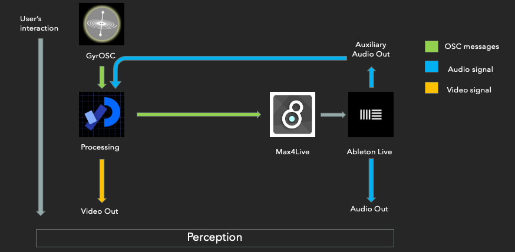
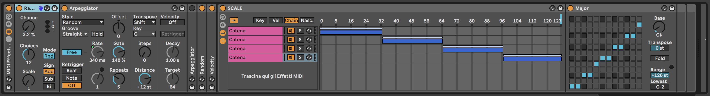
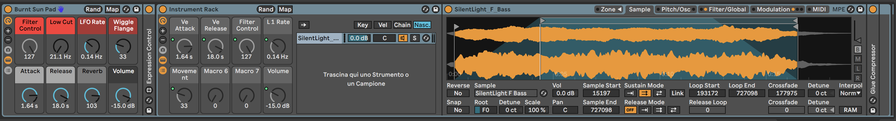
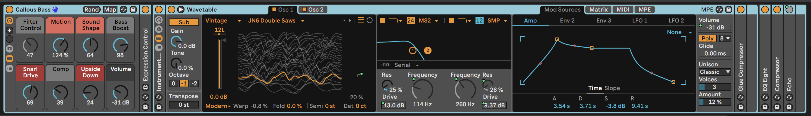
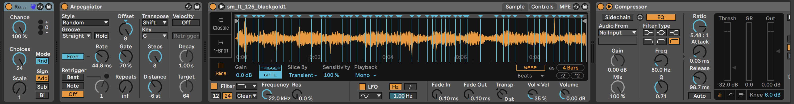
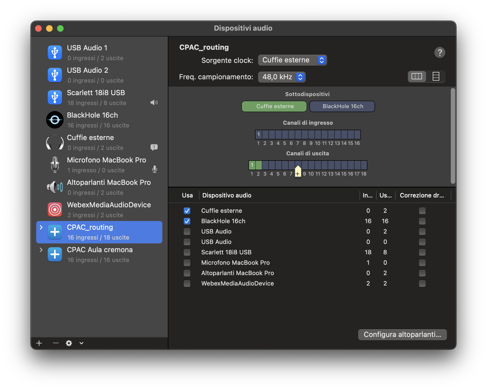

 "E quindi uscimmo a riveder le stelle" 
*(Inferno XXXIV, 139)*
===============

- [*(Inferno XXXIV, 139)*](#inferno-xxxiv-139)
  - [1. Introduction](#1-introduction)
  - [2. Discovering the Project](#2-discovering-the-project)
  - [3.  Technical Explanation](#3--technical-explanation)
  - [4. The Experience](#4-the-experience)
    - [4.1 Night-time](#41-night-time)
    - [4.1 Day-time](#41-day-time)
  - [5. Inside the Scene](#5-inside-the-scene)
    - [5.1 Moon](#51-moon)
    - [5.2 Sun](#52-sun)
  - [6. Stars](#6-stars)
    - [6.1 StarsTable](#61-starstable)
    - [6.2 StarsSystem](#62-starssystem)
    - [6.3 Star](#63-star)
  - [7. Sky](#7-sky)
    - [7.2 pollution](#72-pollution)
    - [7.1 sky](#71-sky)
  - [8. Time](#8-time)
    - [8.1 Time](#81-time)
    - [8.2 events](#82-events)
  - [9. Threads](#9-threads)
  - [10. OSC Communication](#10-osc-communication)
    - [10.1  GyrOSC](#101--gyrosc)
    - [10.2 Ableton Live](#102-ableton-live)
  - [11 Sound Generation](#11-sound-generation)
    - [11.1 Scenes organization](#111-scenes-organization)
    - [11.2 Channel Strip](#112-channel-strip)
      - [11.2.1 MIDI note generator](#1121-midi-note-generator)
      - [11.2.2 STARS](#1122-stars)
      - [11.2.3 SUN](#1123-sun)
      - [11.2.4 Master Section](#1124-master-section)
  - [12. User Guide](#12-user-guide)

Project Presentation - Youtube Link

## 1. Introduction
Our project is about light pollution.

Light pollution contributes to climate change: it modifies in a negative way trees' natural cycles, it distresses many bird species every year and it causes health problems to human beings exposed to artificial light during nighttime.
Artificial light makes us blind to the real night sky because, especially in big cities, light pollution covers the real natural beauty of everything around and above us.

Imagine you could switch off all the artificial lights and discover what is behind this layer of pollution, with astonishment and surprise.

## 2. Discovering the Project
- Physical Tools: 
We give the user the possibility to address his/her phone as a sort of "flashlight": it can be used to project a cone of visibility on the screen discovering what is hidden behind the pollution layer.
The installation will be displayed above the user to emulate night sky view.
- Software Tools:
The design of the starry sky is produced inside the Processing environment, while Ableton Live (11.1) is in charge of the sound generation. The two interacts between each other through OSC protocol.

## 3.  Technical Explanation
We started from a giant database containing stars' coordinates and parameters in J2000 reference system, from which we calculated the position of the stars in a horizontal coordinate system with a time-shift formula. The calculation is based on the position of the user on the Earth and on the current time at which the application is launched, these two parameters set the center of the horizontal reference system onto which the stars are projected. As time flows the stars move respecting their actual trajectories.

Once we set the scene we applied a veil light pollution in front of the sky in order to hide the stars as they would be in a real scenario.

When the application starts, the user is allowed to use a gyroscope to move the little lens on the screen, that makes the user able to discover the stars under the pollution layer.
The gyroscope on the phone communicates with the application with OSC messages. The interaction between the graphical objects produces also OSC messages that are sent to Ableton in order to produce sound.
The following chapters are the detailed explanation of every tool and function used in the application.

## 4. The Experience
The user starts with the phone or any mobile device in his/her hands, connected with the application using gyrOSC on the device.

### 4.1 Night-time
The experience starts at nighttime with the lens in the center of the screen.
In this phase stars are covered by the pollution layer. The user, by moving the lens, is able un unveil the stars from the pollution.

With respect to the number of the stars the user is looking at, the sound generator will produce more frequent notes with different speed.
Also, depending on the color, the sound will be more "crispy" or more "warm".
With the interaction with the moon, the brightness rises and sound will be brighter too.

### 4.1 Day-time
After a while, the sun rises.
In daytime, the user's intervention becomes limited, due to the entrance of the sun.
The sun enhances the sickness of the sky, and now the user is engulfed in a state of powerlessness, and can only live the experience, waiting for the night to come.
The sound is characterized by crackles and distorted bass lines, enhancing the state of anxiety in which the user finds himself/herself.

## 5. Inside the Scene 
As previously explained, there are two different scenarios, nighttime and daytime.

The first is governed by the presence of the moon, and it is more "discovering", due to the fact that the user is able to travel along the application without being disturbed by the sunlight.
The second one by the presence of the sun, and it's counterposed to nighttime as being more introversial and dark. In this phase we want to express the feeling of anxiety one would feel by being deprived of the possibility of enjoying the unveiled night sky.

There are two classes referring to the moon and the sun, explained below. 

### 5.1 Moon 
The *Moon* class is a representation of the moon, made by using the perlin noise technique. 
The algorithm used is the classic *Perlin Noise* in 2D algorithm. In particular, the noise is built in polar coordinates and the light radiation is simulated with a concentric *learpColor*.

### 5.2 Sun 
The sun is made of concentric circles, where the color gradient is obtained by using *lerpColor* method and the dimension is calculated using *processing.sound* library:
the rays are representative of the spectrum of its own sound, this is done by computing the FFT of incoming audio from Ableton, amplitude bands are then drawn along the sun circumference.

## 6. Stars
The stars, together with the nightblue background, form the first layer of the scenario.
In order to generate and to place them respecting their coordinates on the celestial sphere given by the database, the implementation presents three important classes: *Star*, *StarSystem* and *StarsTable*.

### 6.1 StarsTable
*StarsTable* is the class responsible for gathering information directly from the database. It contains a table with a row for each star that lists all the information about the star itself.

The constructor is in charge of reading the database from an external file. The information gathered need to be processed in order to be used, in particular the database contains, as coordinates of the stars, right ascension and declination in the reference system J2000. These two coordinates need to be converted from the equatorial reference system to the horizontal reference system, so that the location of the user on the Earth sets the center of reference. To do so, three methods were implemented: *convRA* which from the right ascension defined in three terms by seconds, minutes and hours gives a single value in degrees; *convDEC* which from the declination defined in three terms by seconds, minutes and degreed gives a single value in degrees; *fromEquaToHoriz* that takes the two single-valued coordinates right ascension and declination and converts them into horizontal coordinates. The latter one contains a computation of the current time at which it is called with respect to the time at which is app was launched, this is done in order to keep track of the rotation if the Earth responsible for creating the stars' trajectiories. Other conversions concern the temperature of the stars and their apparent magnitude, which are needed both for the display and for the sound generation.

### 6.2 StarsSystem
*StarSystem* class manages the collection of all the stars listed in the *StarsTable* object, it contains an arraylist of *Star* objects and a local reference to the global instantiation of the *StarsTable* object, which is passed as pointer to the constructor of *StarsSystem* as argument.
The method *fillSystem* is used to take stars from the database and put them into the arraylist, while *starFallsIntoScreen* is used to discriminate which stars have coordinates inside the maximum height and width of the application screen. Finally, the stars that are indeed contained inside the screen are plotted with the *plot* method.

### 6.3 Star
The class Star defines the object representing a single star.
Inside the constructor a row from the star table is given as argument and from there it takes all the information needed about the single star. Other variables are defined which are required as extremes of interpolation for the color of the star based on its temperature.
The methods are: *convColor* which, indeed, takes as argument the temperature and interpolates the color; *fromHorizToCart* which grabs the coordinates of the star in the horizontal reference system (which are the angles of azymuth and altitude) and converts them into cartesian coordinates (x, y) directly used to set the position of the star onto the screen; *plot* which is the method that draws the single star based on the given/calculated parameters.

## 7. Sky 
The sky part forms the second and third layers, placed above the stars, covering them. It is divided in two main parts: the class pollution and the class sky. 

### 7.2 pollution
*Pollution* is made by using the perlin noise technique in 3D: two coordinates are x position and y position of the pixel and the third one is time, so that it is rendered with a dynamic graphic.
The constructor sets the parameters for the perlin noise generation.

The *plot* method adds complexity to the algorith: we don't want the stars to be fully hidden by the pollution, we want them to be blurred by it, but since the perlin noise generation requires to work directly on the pixels matrix object the underlying starry sky would be simply overwritten. The method makes use, therefore, of the *lerpColor* function interpolating the color of the pixel belonging to the starry sky layer with the color of the pixel which should belong to the pollution only. *plot* is also responsible of generating the cone of visibility controlled by the user through GyrOSC: The perlin noise is generated only outside a circle centered on the coordinates of the pointer, so that inside that circle the starry sky layer is not covered.

The second important method is called *countingStars*, which is used to process some parameters inside the previous method. The processed parameters will then be sent to ableton in OSC messages in order to modify the sound generation based on what lays inside the cone of visibility.

### 7.1 sky
The third and last layer is the closer to the user, so it covers both the stars and the pollution, but since its opacity is controlled by the sound amplitude and since we used *colorLerp* to render the pollution layer the overall behaviour is quite interesting.

*Sky* is composed of concentric circles centered on the sun. The color gradient is made using *lerpColor* function so that the further we are from the sun the less invasive the sky layer is. The opacity is instead obtained using both the amplitude of the incoming signal and the distance of the sun from the center of the screen. Since the sound does not keep the sky at a constant opacity and since the opacity reaches high values only when the sun is near the center, there are periods of time (corresponding to dawn and sunset) in which the stars may still be seen. Inside these periods the interaction between the sky and the pollution layers generates graphical effects that underline, once again, the sickness of the sky due to light pollution.

## 8. Time
The flow of time is an important feature for this application as it provides immersiveness to the user by creating the feeling of constant evolution of the environment around him/her.

### 8.1 Time
From the very beginning we want to make sure that on the projected screen we see the stars that actually lay above the user's head as the application is launched. Since the reference system J2000 is a time reference corresponding to the 1st of January of the year 2000 precisely at noon, we need to compute the time passed from that date to the current one at application launch.
In order to do so we implemented the class *Time* that makes use of the *java.util.Calendar* library.

The constructor sets and instantiation of the *Calendar* object.
From this object, the *localHourFraction* method gathers information about the current hour, minute, second and millisecond inside the day and returns a single values float representing the time as a fraction of the 24 hours.
The method *daysSinceJ2000* gathers other information from the *Calendar* object, which are the current year, month and day and it returns a value which is, together with the given argument, a float value representing the total fractional number of days passed from the J2000 reference.
Finally, the method *timePassingCalc* applies a time step at each update of the coordinates of the stars. The step amount is controlled by a global variable called *timelapse* which let us control the flow velocity as we please.

### 8.2 events
The *events* module provides the functions needed to control the exchange between the sun and the moon, both on the graphic and on the sound. There is also a function that, during daytime, controls the presence of sunlight on the surrounding building, again controlled through the amplitude of the sound.

## 9. Threads
All the classes related to the sky layers need to be updated as time flows in order to create the dynamicity. Since these updates are computationally expensive and prevent the global function *draw* to work properly with respect to the framerate, we decided to place them inside threads. The method *run* is implemented in order to update only the class given as argument to the constructor of the thread. Given the need to coordinate the order of updates of stars coordinates, stars plot and pollution plot, the threads communicates through a semaphore.

## 10. OSC Communication 
The communication part is divided into two main parts, the communication with Ableton Live and the communication with GyrOSC

### 10.1  GyrOSC
The communication with GyrOSC takes place in the main, with the method oscEvent.
We take three parameters from GyrOSC that are the gyroscope, the accelerometer and the GPS. 
Every parameter has an associated OSCAddress that is taken by Processing and from which we take the relevant attributes of each parameter. 
For the gyroscope parameters used are beccheggio and rollio, for the accelerometer parameters are the acceleration values in the x and y axis. GPS values are latitude and longitude.
These parameters are taken by calling arguments() method.
For our application we needed to split all three parameters, and that has been made by calling the CheckAddrPattern method, so that we could manage the values coming from the gyroscope, accelerometer and GPS separately.

### 10.2 Ableton Live
In Ableton Live the Connection Kit is used (provided by Ableton website and implemented in Max for Live). It provides several devices that allows to communicate with OSC messages. In particular, the main tool is named OSC TouchOsc.amxd that is linked with correct OSC addresses in order to receive messages, then is mapped to parameters in the Live session. Moreover, given that the Connection Kit does not provide a device that change scenes through OSC, a proper tool has been built in M4L.

## 11 Sound Generation
All the audio processing is done in Ableton Live.

### 11.1 Scenes organization

Night time and Day time corresponds to two different sounding scenarios, so two main scenes are used, as visible in the figure down below: 

- Moon: activated during the Night time.
- Sun: activated during the Day time.
  

### 11.2 Channel Strip

Several tracks are present, they are organized four sections:
  - MIDI note generator: this tracks contain the random midi note generator that, according to parameters sent through OSC from Processing, generate a sequence of note.
  - STARS: responsable for the instruments played by the interaction with the stars.
  - SUN: responsable for the instruments that play accordingly to the position of the sun.
  - Master section: master out of the system and the channel that send the audio to the an input in processing for the FFT representation of the sun.

#### 11.2.1 MIDI note generator
In this track are present the tools for the generation of the notes. In order to do that, a MIDI Effect Rack is built with the following Ableton effects:
- Arpeggiator: from one single MIDI note (from the launched clip) generates note with random jump. The Rate parameters is controlled by OSC messages (number of stars). There are two of those that changes present with the scene launch: one is more randomic, the other is set to *Up* arpeggios.
- Random: create the random sequence (only for the pitch) from the arpeggiator
- Velocity: randomize the velocity of the MIDI note
- SCALE: this is a chain selector where, depending on the position of the pointer on the screen, the OSC message communicates the correspondant chain. Each chain is composed by a Scale effect that bring the random notes in a major scale. Due to the bass note that is playing a *pedale* the effect result in a modal organization of the sound.

#### 11.2.2 STARS
This is a group containing the instruments that generate the sound from the star, that are:
- FM Oscillator (made with Operator) for the Night time.
- Piano for the Day time.
- Bass Synth (made with Sampler) which filter control depends on the accelerometer on the user's device.
  
#### 11.2.3 SUN
Here the group is responsable for the sound of the arising sun. The volume of this group is determined by the position of the sun. It consists in:

- Bass Synth implemented in Wavetable.
- A track containing the sonorization of the (real) electromagnetic waves of the Sun.
- An Instrument track made with Simpler in Slice mode. This Instrument uses the Sun electromagnetic waves as a sample and chops it accordingly to the sensitivity parameter in the peak detection algorithm of the instrument. Then, this chops are played randomly.
  
#### 11.2.4 Master Section
In the master section are present all the OSC receiver (they are global) and a monitoring plug-in built in M4L in order to see on screen the incoming OSC messages. At the end of the chain is present a Limiter going in the output 1-2.
The FFT channel is going in the 3-4 parallel output that is then processed by the Sound Analyzer in Processing. On the channel are present a Saturator plug-in, EQ Three and a Limiter so it is possible to enhance the overall frequencies, making the FFT visualization of the sun's rays more homogeneus.

## 12. User Guide
This project has been built for MacOs (built on MacOS Monterey).

The softwares used to create the interactive experience are the following ones: 

1- Processing, that constitutes the core application used for the code development and the visual installation. 

https://processing.org/

2- Sound Module, by Processing.

https://processing.org/reference/libraries/sound/index.html

3- Ableton Live 11 Suite(M4L included), for the sound generation and in general every sound related feature in the application.

https://www.ableton.com/en/live/

4- GyrOSC, for the user interaction with the installation.

https://apps.apple.com/us/app/gyrosc/id418751595 (Apple)
https://baixarapk.gratis/en/app/418751595/gyrosc (Android)

5- Connection Kit, downloaded directly as a Ableton feature.

https://www.ableton.com/en/packs/connection-kit/

6- Black Hole Driver, an audio driver that allows to create internal digital routing from Ableton to Processing and from Ableton to an external main out at the same time.

https://github.com/ExistentialAudio/BlackHole

In order to configure the BlackHole driver the user must open the Audio MIDI Setup and create a new combined device, then select firstly the main out and secondly the BlackHole driver.

 
 

